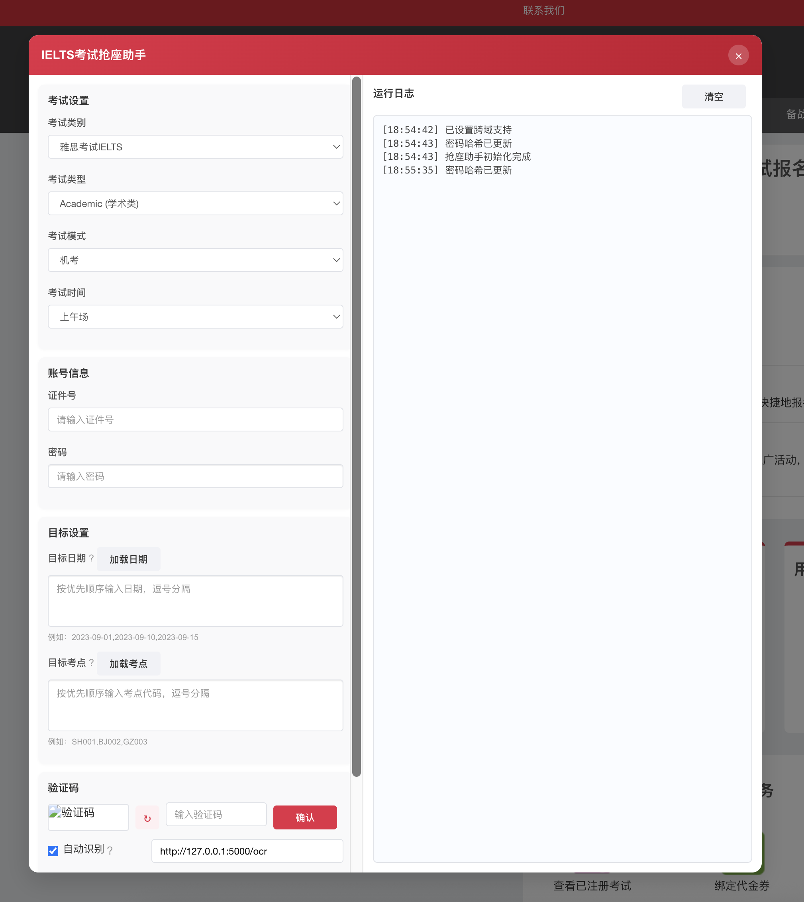

# ielts-auto-booking
适用于中国大陆雅思考试（IELTS）官网报名系统的油猴（Tampermonkey）自动抢座脚本，功能强大且全面，支持自动登录、智能抢座、验证码自动识别、网络自适应及错误自动重试。

## 程序界面

<!-- 程序运行示例 -->

## 功能详细说明

### 自动登录
- 自动保存账号与密码（本地安全加密存储）
- 支持SHA-256加密密码以确保安全性
- 登录失效自动重新登录

### 智能抢座
- 自定义考试类别（普通雅思、UKVI签证雅思、生活技能类考试）
- 支持学术类与培训类考试模式
- 可配置机考或纸笔考试模式，机考支持选择上午、下午或晚场
- 支持多个目标考点与日期，按设定的优先级自动抢座

### 验证码自动识别
- 支持自定义OCR服务自动识别验证码
- 验证码识别失败时自动重试或提供手动输入备选

### 网络自适应与错误重试
- 根据网络成功率自适应调整请求超时时间
- 网络请求失败或超时自动重试，保障抢座过程稳定性

### 用户界面友好
- 页面内嵌控制面板，参数设置方便直观
- 实时日志展示操作过程，方便用户追踪与问题排查
- 验证码界面直接集成刷新和手动提交功能

### 高度自定义参数
- 自定义抢座轮询间隔、网络超时、验证码识别服务地址等
- 可设置抢座策略，如优先考点与日期顺序

### 通知推送
- 支持短信推送，抢座成功时自动通知用户（需自备短信服务接口）

## 安装步骤

1. 安装浏览器扩展：[Tampermonkey官网](https://www.tampermonkey.net/)
2. 在Tampermonkey中新建脚本，并将`ielts.js`文件内容复制到其中保存
3. 访问雅思官网[ielts.neea.cn](https://ielts.neea.cn)即可自动加载脚本界面

## 使用说明

1. 在控制面板中配置考试类型、模式与目标日期、考点
2. 设置并保存登录的账号密码
3. 根据需要开启验证码OCR识别功能，并配置OCR服务地址
4. 点击“开始抢座”按钮执行自动抢座操作

## 注意事项

- 此脚本仅供个人学习与交流，严禁用于非法用途或商业用途
- 由于官网流量及网络环境等原因，脚本无法确保100%抢座成功，请提前进行充分测试
- 若使用OCR自动识别，请确保OCR接口可用，且响应快速稳定

## 开源许可

MIT License

